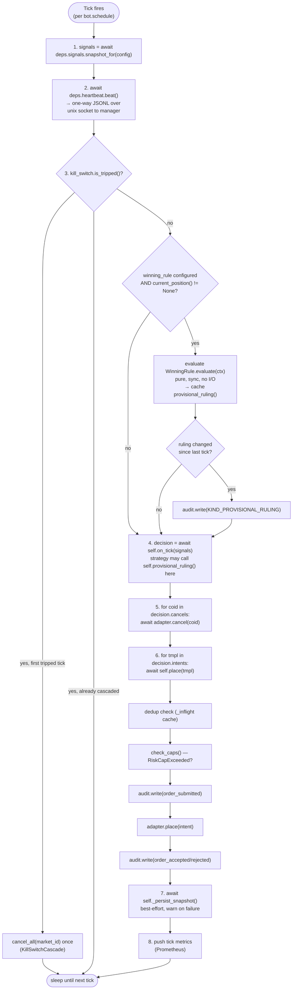
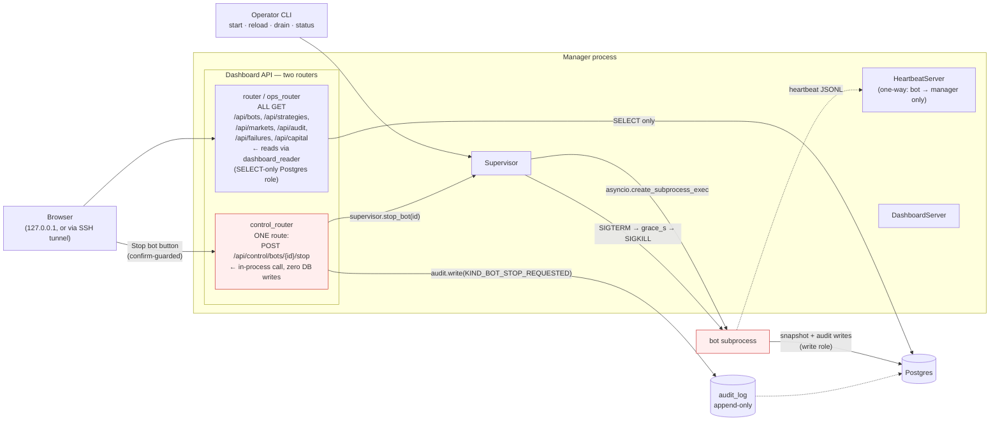
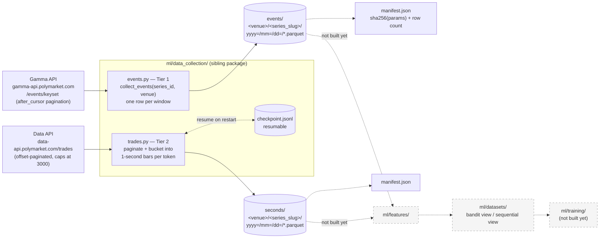

# Architecture — Detailed Diagram

Zoomed-in view of the internal flows the high-level diagram (`architecture-diagram.md`) collapses into single boxes. Three parts: the bot tick loop, the manager's control surface (including the new stop-bot path), and the offline `ml/` pipeline.

## 1. One bot tick — `BaseBot.run()`

**What's new here (this session):** step 3.5 — the optional winning-rule evaluation. It sits between the kill-switch check and `on_tick`, is entirely skippable (no config, no `current_position()` override → always `None`, zero cost), and never influences steps 5/6 on its own — the strategy has to read `self.provisional_ruling()` from inside its own `on_tick` and decide what to do.

## 2. Manager control surface

**Key distinction, drawn explicitly because it's easy to conflate:**

| Mechanism | Scope | Effect | Reversible? |
|---|---|---|---|
| Global kill switch (`src/risk/`) | All bots | Freezes new order placement; process keeps running | Yes — `KillSwitchWriter.reset()` |
| `Supervisor.stop_bot(id)` (new) | One bot | Terminates the subprocess (SIGTERM → grace → SIGKILL) | No — bot must be respawned via `reload` |
| Provisional winning rule (new) | One bot's own decision | Purely informational; strategy decides whether to act | N/A — never touches control flow itself |

## 3. Offline `ml/` pipeline (Tier 1 + Tier 2 collectors)

Both collectors are fully generic — `series_id`/`venue` are always explicit arguments, never hardcoded. Today's only populated dataset is `polymarket/btc-up-or-down-5m/` (6 months of Tier 1, a 2-week pilot of Tier 2), but the same code works for any other Polymarket recurring-market series by passing a different `series_id`.
