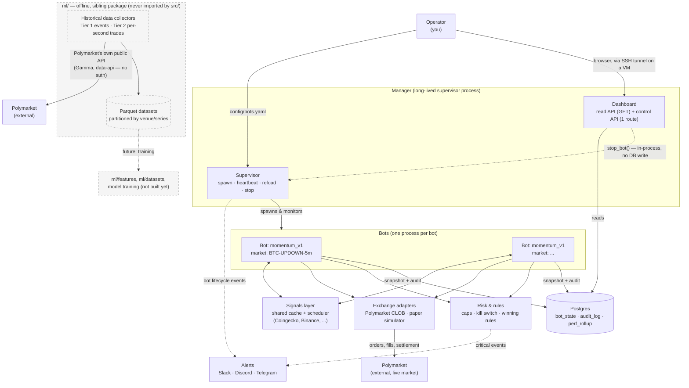

# Architecture — High-Level Diagram

A human-readable, big-picture view of the platform. For the detailed internal-flow diagram, see [`architecture-diagram-detailed.md`](architecture-diagram-detailed.md). For implementation specifics, see [`architecture-summary.md`](architecture-summary.md). This diagram supersedes the ASCII sketch in `architecture.md` with the pieces added since (`ml/`, `src/rules/`, the dashboard control route).

## Reading this diagram

| Box | What it is | Key fact |
|---|---|---|
| **Manager** | One long-lived process | Runs the `Supervisor` (spawns/monitors bots) and the `Dashboard` (read-only web UI + the one control route) in the same process |
| **Bots** | One OS subprocess per configured bot | Each runs a single strategy against a single market, on its own tick schedule |
| **Signals layer** | Shared fetch/cache scheduler | 50 bots watching BTC price make 1 upstream call, not 50 |
| **Exchange adapters** | Translate strategy intent ↔ exchange wire format | Polymarket CLOB (live) or an in-memory paper simulator — same interface either way |
| **Risk & rules** | Caps, kill switch, and the new optional provisional winning-rule framework | Enforced inside `BaseBot.place()` — a strategy cannot bypass it |
| **Postgres** | Durable state | `bot_state` (snapshots), `audit_log` (append-only), `perf_rollup` (materialized view for the dashboard) |
| **Dashboard** | Read-only web UI, one narrow exception | Everything is `GET` except one `POST /api/control/bots/{id}/stop`, which never touches Postgres |
| **`ml/`** | Offline, disconnected from live trading | A sibling package that collects Polymarket's own historical market data for future model training — not wired into `src/` at all |

The dashed box is offline/optional infrastructure — it doesn't run on the trading path and nothing in it can affect a live bot.
